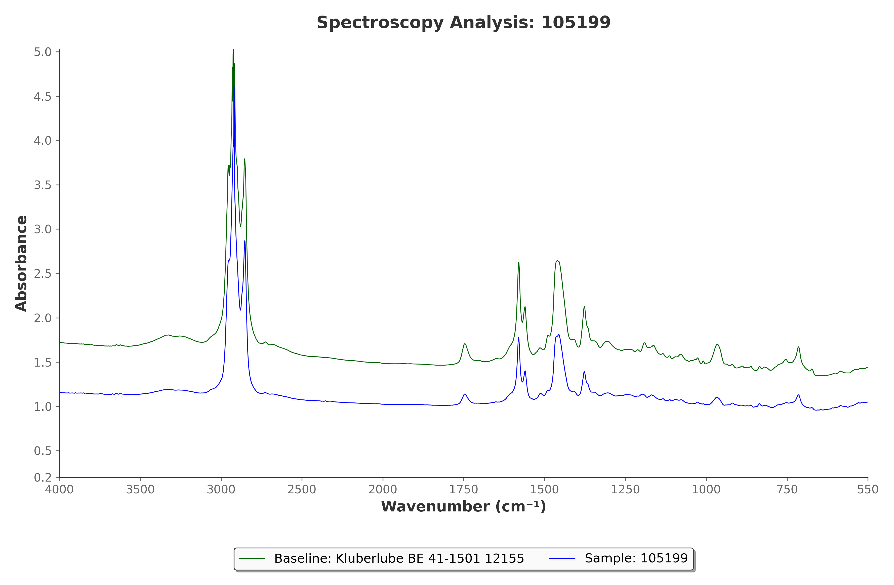

# MRG Labs Graph Analysis Tool

[](https://react.dev)
[](https://www.typescriptlang.org)
[](https://fastapi.tiangolo.com)
[](https://www.python.org)
[](https://docs.docker.com/compose/)

[Overview](#overview) • [Features](#features) • [Getting started](#getting-started) • [Usage](#usage) • [Documentation](#documentation) • [Project structure](#project-structure)

Upload a baseline FTIR CSV and multiple sample CSVs, overlay spectra in the browser, score how each sample compares to the baseline, and batch-export publication-ready PNG graphs — with optional Gemini-powered analysis and chat.

<video src="./assets/graph-analysis-sr.mov" controls width="100%" title="Application screen recording"></video>

<p align="center"><em>Application walkthrough</em></p>

## Overview

This full-stack app turns raw spectroscopy CSVs into a practical comparison workflow for lab use:

- **Interactive preview** — Chart.js overlay of baseline vs selected sample with zoom, pan, and custom X-axis scaling
- **In-browser scoring** — Weighted wavelength regions and hybrid similarity methods tuned for FTIR grease analysis
- **Batch export** — Matplotlib PNGs packaged as a ZIP (optional Chromium folder picker via the File System Access API)
- **AI assist** — Google Gemini insights and an optional chat assistant for interpretation questions

Most day-to-day analysis runs in the browser. The FastAPI backend handles authentication, PNG generation, and AI services. MySQL stores users and graph metadata.

```
Browser (React / Vite)
  ├── Dashboard, uploads, Chart.js preview + scoring
  ├── Export dialog → POST /generate_graphs
  └── Chat / analysis UI → Gemini routes
           │  session cookie
           ▼
FastAPI  →  MySQL  +  Gemini API  +  Matplotlib exports
```

## Features

- Baseline (single) + multi-sample CSV upload with live overlay preview
- Deviation heatmap and sample ranking against the baseline
- Configurable scoring methods and zone weights for FTIR regions of interest
- Session-based auth (signup, login, logout, change password)
- Batch PNG export with standard download or Chromium folder export
- AI graph insights and conversational Q&A (requires `GEMINI_API_KEY`)

### Exported graph example



<p align="center"><em>Example PNG export: baseline vs sample overlay with absorbance vs wavenumber (cm⁻¹)</em></p>

## Getting started

### Prerequisites

- [Node.js](https://nodejs.org/) 18+ (20 recommended)
- [Python](https://www.python.org/) 3.11+
- [MySQL](https://www.mysql.com/) 8.0+
- [Docker](https://www.docker.com/) (optional, for compose deployment)
- A [Google AI Studio](https://aistudio.google.com/apikey) API key if you want AI analysis/chat

### Option A — Docker Compose

```bash
# Configure backend/env first (see Environment below)
docker compose build
docker compose up
```

| Service  | URL                      |
|----------|--------------------------|
| Frontend | http://localhost:5173    |
| Backend  | http://localhost:8080    |

### Option B — Local development

#### 1. Database

```bash
mysql -u root -p < backend/database_setup.sql
```

#### 2. Backend

From the repository root:

```bash
python -m venv backend/venv
source backend/venv/bin/activate   # Windows: backend\venv\Scripts\activate
pip install -r backend/requirements.txt
```

Create `backend/.env`:

```bash
DB_HOST=localhost
DB_USER=root
DB_PASS=your_password
DB_NAME=mrg_labs_db
SESSION_SECRET=$(openssl rand -hex 32)
GEMINI_API_KEY=your_gemini_key   # optional; AI features need this
```

> [!NOTE]
> `DB_PASSWORD` is accepted as an alias for `DB_PASS`. `SECRET_KEY` is accepted as an alias for `SESSION_SECRET`.

Start the API (still from the repository root, with the venv active):

```bash
python -m uvicorn backend.app:app --reload --port 8080
```

#### 3. Frontend

```bash
cd frontend
npm install
npm run dev
```

Open **http://localhost:5173** and create an account via **Sign Up**.

> [!TIP]
> In development, Vite proxies `/generate_graphs`, `/static`, and `/api/analysis` to the backend on port 8080.

## Usage

1. **Sign up / log in**
2. **Upload** one baseline CSV and one or more sample CSVs
3. **Inspect** the interactive overlay; review sample scores in the sidebar
4. **Ask AI** (optional) for insights or chat about the comparison
5. **Export** graphs as PNG — either a ZIP download, or a chosen folder in Chromium-based browsers

> [!IMPORTANT]
> Folder export uses the File System Access API and works in Chrome, Edge, Opera, and other Chromium browsers. Firefox and Safari fall back to the standard ZIP download.

## Documentation

| Doc | Description |
|-----|-------------|
| [docs/onboarding.md](docs/onboarding.md) | Codebase map and key call paths |
| [docs/PIPELINE.md](docs/PIPELINE.md) | End-to-end data flow |
| [docs/API_DOCUMENTATION.md](docs/API_DOCUMENTATION.md) | Analysis and chat API details |
| [docs/FTIR_SCORING_METHODOLOGY.md](docs/FTIR_SCORING_METHODOLOGY.md) | Scoring methods and wavelength weighting |
| [AGENTS.md](AGENTS.md) | Engineering standards for contributors and agents |

## Project structure

```
Graph-analysis-tool/
├── frontend/                 # React + Vite + TypeScript + Chakra UI
│   └── src/
│       ├── features/         # auth, dashboard, analysis
│       ├── components/       # shared UI (chat, export, sidebar)
│       ├── services/         # HTTP clients
│       └── lib/              # pure series / scoring helpers
├── backend/                  # FastAPI app
│   ├── app.py                # routes: auth, generate_graphs, health
│   ├── graph_analysis.py     # Gemini insights
│   ├── chatbox.py            # AI chat
│   ├── utils/plotter.py      # Matplotlib PNG export
│   └── tests/                # pytest suite
├── docs/                     # architecture and methodology
├── assets/                   # README demo media
├── docker-compose.yml
├── Dockerfile.backend
└── Dockerfile.frontend
```

## Development

```bash
# Frontend
cd frontend && npm run test -- --run && npm run build

# Backend
pytest backend/tests -q
```

## Tech stack

| Layer | Stack |
|-------|--------|
| Frontend | React 18, Vite, TypeScript, Chakra UI, Chart.js, Papa Parse |
| Backend | FastAPI, Pandas, Matplotlib, bcrypt, Google Generative AI |
| Data | MySQL |
| Deploy | Docker Compose, nginx (frontend production image) |

---

Built for the **2025 Schneider Prize** challenge · MRG Labs
